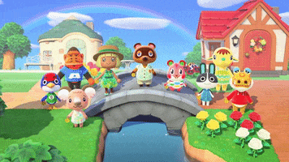

# Paula Nieto (she/her)

|￣￣￣￣￣￣￣ |   
|&nbsp;&nbsp;&nbsp;&nbsp;&nbsp;&nbsp;&nbsp;&nbsp;&nbsp;&nbsp;&nbsp; HI &nbsp;&nbsp;&nbsp;&nbsp;&nbsp;&nbsp;&nbsp;&nbsp;&nbsp;&nbsp;|    
| ＿＿＿＿＿＿＿|    
(\\\__/)&nbsp;&nbsp;||    
(•ㅅ•) ||    
/ 　 づ 

I'm Paula, a young Computational Biotechnologist highly motivated and with a lot to learn ahead! 

## What I'm up to right now

:round_pushpin: At the moment I work as a Bioinformatician/Data Analyst at CNAG-CRG in Barcelona, Spain ([check us out!](https://cnag.crg.eu/teams/genome-research-unit/single-cell-genomics-team)).
My research focuses on cancer, immunology and immunotherapy but not exclusively!

I'm very enthusiastic about reproducibility and open science and I'm all about equal oportunities for women, people of color and LGBTQIA+ folks in science! :rainbow:

## Find me elsewhere!
Twitter: http://twitter.com/paulanietog/

